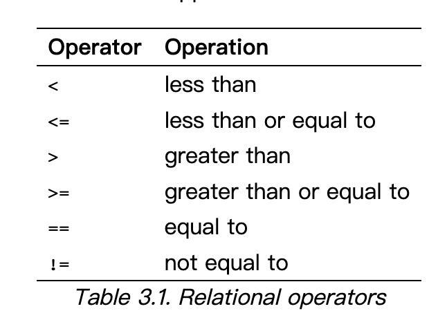

# Control Flow

## 3.1.1. Logical expressions and Relational Operators



## example:example_3_1
## example:error_compre_example.c

## 3.2.1. The if statement

### 

| c synctax | python syntax |
|---|----|
|<pre>if(condition1) statement </pre>| <pre>if(condition1):<br>    statement </pre>|
|<pre>if(condition1) statement1<br>else statement2</pre>| <pre>if condition1:<br>    statement1 for True condition<br>else:<br>    statement2 for False condition<pre>|
|<pre>if(condition1) statement1<br>else if(condition2) statement1<br>else  statement3</pre>|<pre>if condition1:<br>    statement1 for True Condition1<br>elif condition2 :<br>    statement2 for True Condition2<br>else:<br>    statement3</pre>|

###  這個else 到底是對到哪個if?
```
if(expression)
  if(expression)
    statement
  else
    statement
```


### C 排版排的比較好的做法
```
if(condition1) {
    statement1
}else if(condition2){
    statement2     
}else {
    statement2
}    
```

## 3.2.2. The while and do statements
The while is simple:

| c synctax | python syntax |
|---|----|
|<pre>while(condition)<br>    statement</pre>|<pre>while condition:<br>    statement</pre>|


do while
```
do
    statement
while(expression);
```

## 3.2.3. The for statement
| c synctax | python syntax |
|---|----|
|<pre>for (initialize; check; update) <br>    statement</pre>|<pre>for x in sequence:<br>    # 放要執行的東西</pre>|
## example:control_flow.c,control_flow.py

## 3.2.5. The switch statement
```
switch (expression){
    case const1:    
        statements
        break;
    case const2:    
        statements
        break;
    default:        
        statements
}
```
### example : example_3_5.c

## 3.2.6 The break statement

### example : example_3_7.c, example_3_7_2.c

## 3.2.7 continue
### example : example_3_8.c

## 3.2.8. goto and labels
### example : goto_lable.c
