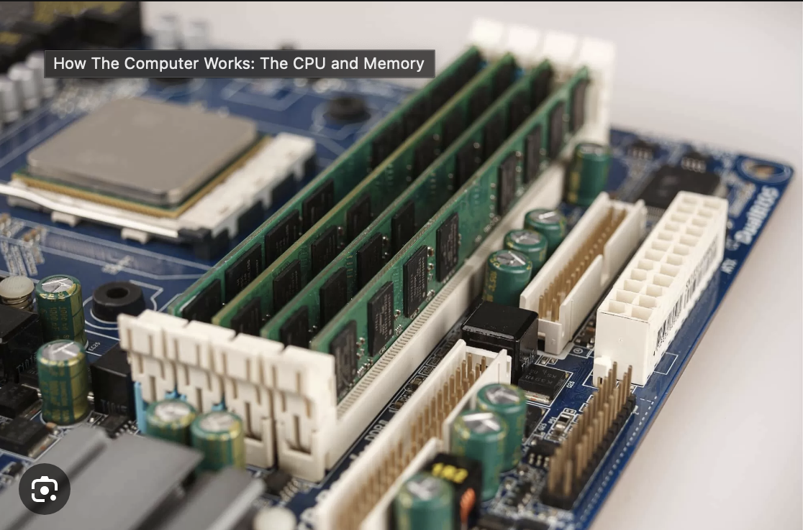
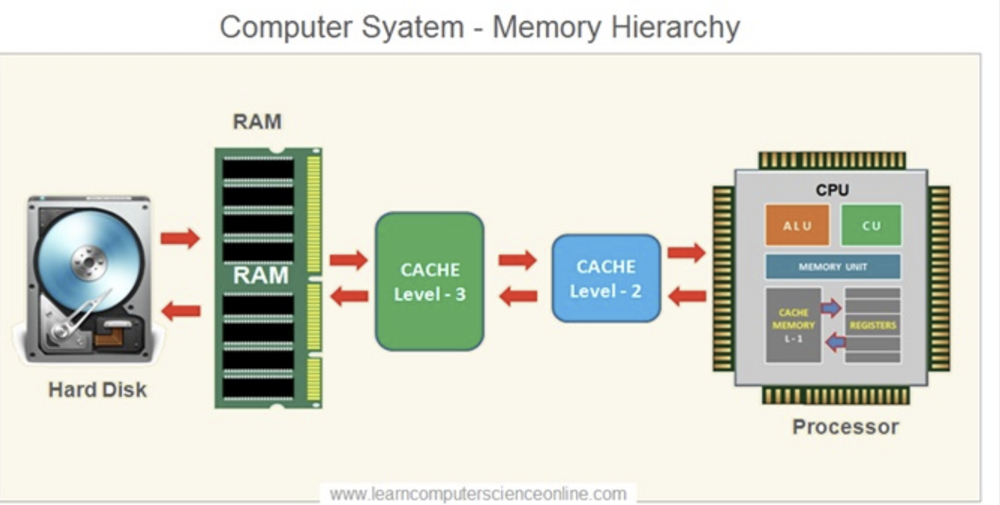
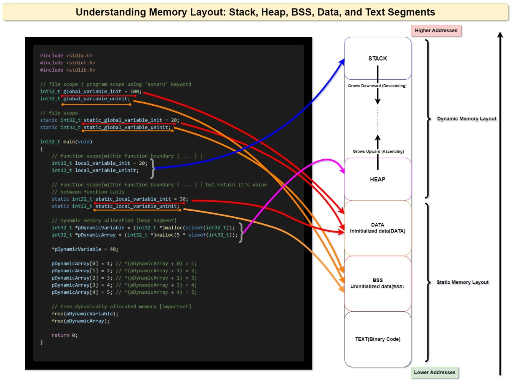
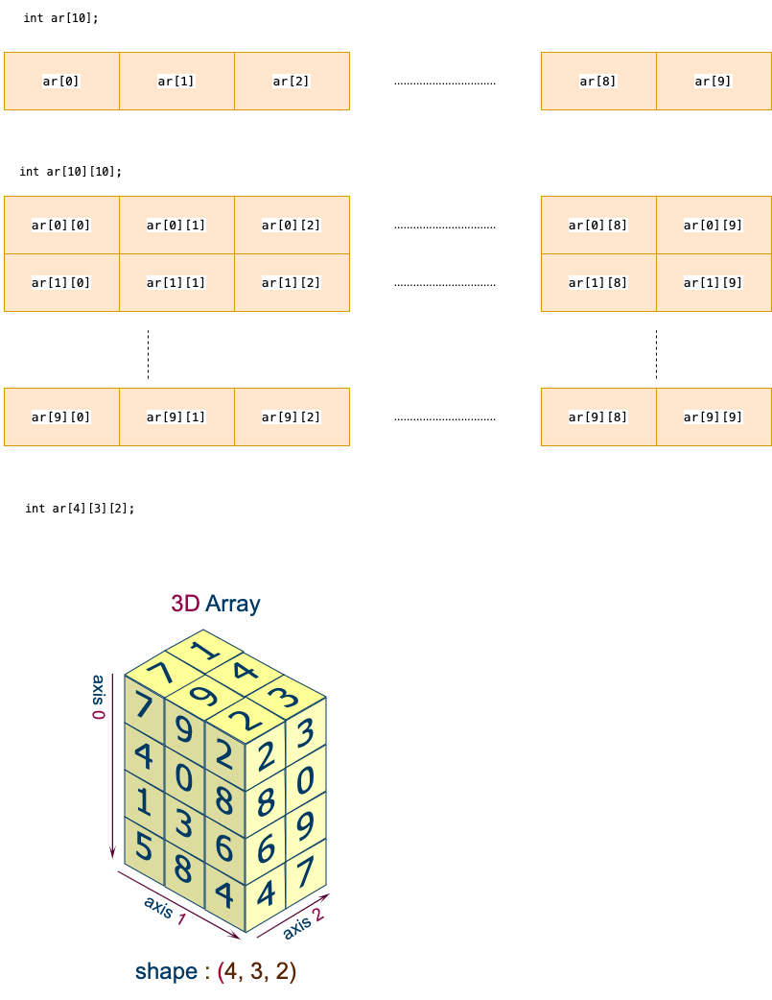
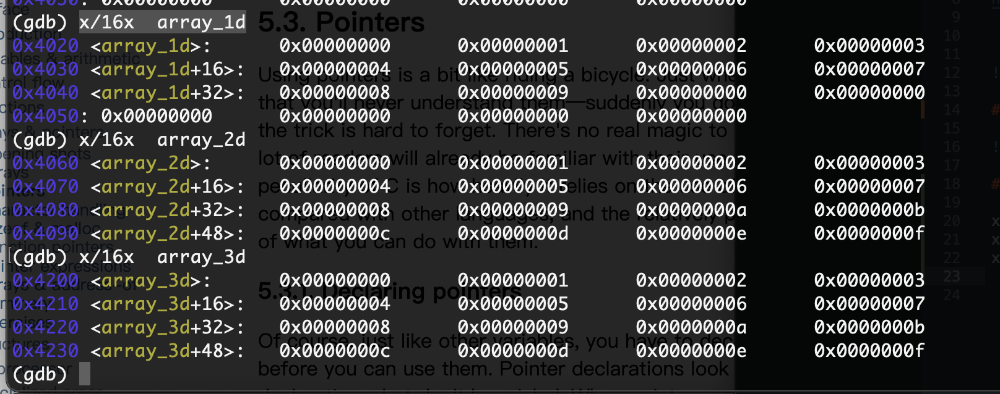
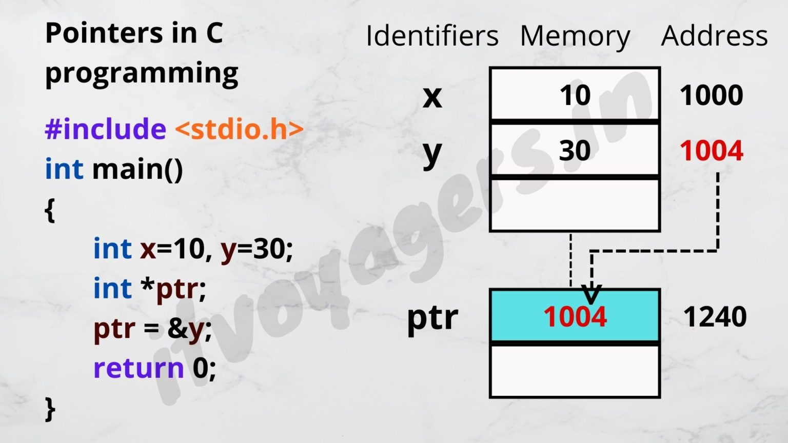
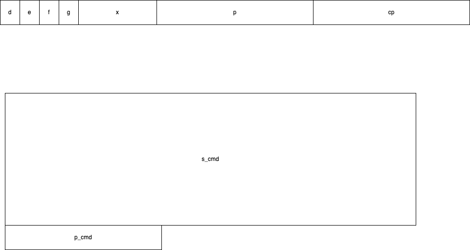
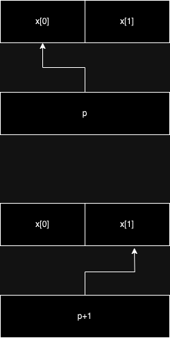

# 5 arrays

32 bits vs 64 bits

32位元和64位元分別表示什麼？
電腦裡寫的32位元，64位元其實是指的CPU GPRs（General-Purpose Registers，通用寄存器）的數據寬度分別為32和64位元。

應用到實際生活中，我們可以從下面2個層面來討論：

應用程式層面：32與64位元程式，是指經過匯編語言編譯後的可執行檔案，比如C語言編寫的應用程式就需要區別是32位元還是64位元。

系統硬體層面：CPU一次處理數據的能力是32bit還是64bit，將會涉及到作業系統應該是裝32bit還是64bit的。

以下內容節選自維基百科：

“64位元CPU是指CPU內部的通用暫存器的寬度為64位元，支援整數的64位元寬度的算術與邏輯運算。 ”

32位元/64位元差異：記憶體容量
64位元最大的記憶體理論上限是16EB，相當於16777216TB，換算成GB則是171億7986萬9184GB，目前世界上容量最大的記憶體其實都遠遠低於這個上限，故64位元在實際上可被視為無限大。

記憶體的大小的演算法是2的多少次方，例如16位元的記憶體上限是2的16次方即65536Bit=64KB，而32位元為2的32次方即4,294,967,296Bit=4GB，以此類推而64位元就是2的64次方即17179869184GB=16777216TB=16384PB=16EB。

https://www.mytechgirl.com/tw/windows/windows-10-32bit-64bit-difference-mtg6688.html#_3






memory usage
https://www.linkedin.com/pulse/understanding-memory-layout-stack-heap-bss-data-text-segments-shah/




## 5.2 arrays



### using gdb to display memory

```
x/16x  array_1d
x/16x  array_2d
x/16x  array_3d
```



### Example
example_5_2.c


https://itvoyagers.in/understand-pointers-in-c-programming-in-easy-way-1/





### Example
example_5_1.c, example_5_1_2.c



### Example
example_5_4.c, example_5_4_2.c

## C spec (https://www.dii.uchile.cl/~daespino/files/Iso_C_1999_definition.pdf)
sec6.5.2.1
```
6.5.2.1 Array subscripting
Constraints
1 One of the expressions shall have type ‘‘pointer to object type’’, the other expression shall
have integer type, and the result has type ‘‘type’’.
Semantics
2 A postfix expression followed by an expression in square brackets [] is a subscripted
designation of an element of an array object. The definition of the subscript operator []
is that E1[E2] is identical to (*((E1)+(E2))). Because of the conversion rules that
apply to the binary + operator, if E1 is an array object (equivalently, a pointer to the
initial element of an array object) and E2 is an integer, E1[E2] designates the E2-th
element of E1 (counting from zero).
```
```
5.8. Arrays, the & operator and function
We have already emphasized that in most cases, the name of an array is converted into the address of its first element
```

Example: test_array.c

## 5.4. Character handling
Example: 5_6.c,  5_7.c ,  5_8.c

## 5.4.3. Untyped pointers
Example: test_malloc.c

## 5.5. Sizeof
Example: 5_14.c, 5_15.c
