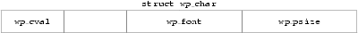

# Structures

example: 6_1.c

# Unions
example: 6_11.c

# Bitfields
example 6_13.c (Bad example)

linux kernel example: 
https://android.googlesource.com/kernel/common/+/a7827a2a60218b25f222b54f77ed38f57aebe08b/include/linux/skbuff.h#391

# enums
enums.c

# volatile
volatile.c
