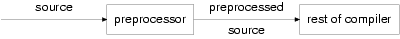

# Preprocessor

* Directive	Meaning
# include	include a source file
# define	define a macro
# undef	undefine a macro
# if	conditional compilation
# ifdef	conditional compilation
# ifndef	conditional compilation
# elif	conditional compilation
# else	conditional compilation
# endif	conditional compilation
# line	control error reporting
# error	force an error message
# pragma	used for implementation-dependent control
#	null directive; no effect
Table 7.1. Preprocessor directives

#define SQR(x)  ( x * x )
* Example: 7_1.c

* 7.3.5. Predefined names
The following names are predefined within the preprocessor:

__LINE__
The current source file line number, a decimal integer constant.
__FILE__
The ‘name’ of the current source code file, a string literal.
__DATE__
The current date, a string literal. The form is

Apr 21 1990
where the month name is as defined in the library function asctime and the first digit of the date is a space if the date is less than 10.

__TIME__
The time of the translation; again a string literal in the form produced by asctime, which has the form "hh:mm:ss".

* #error